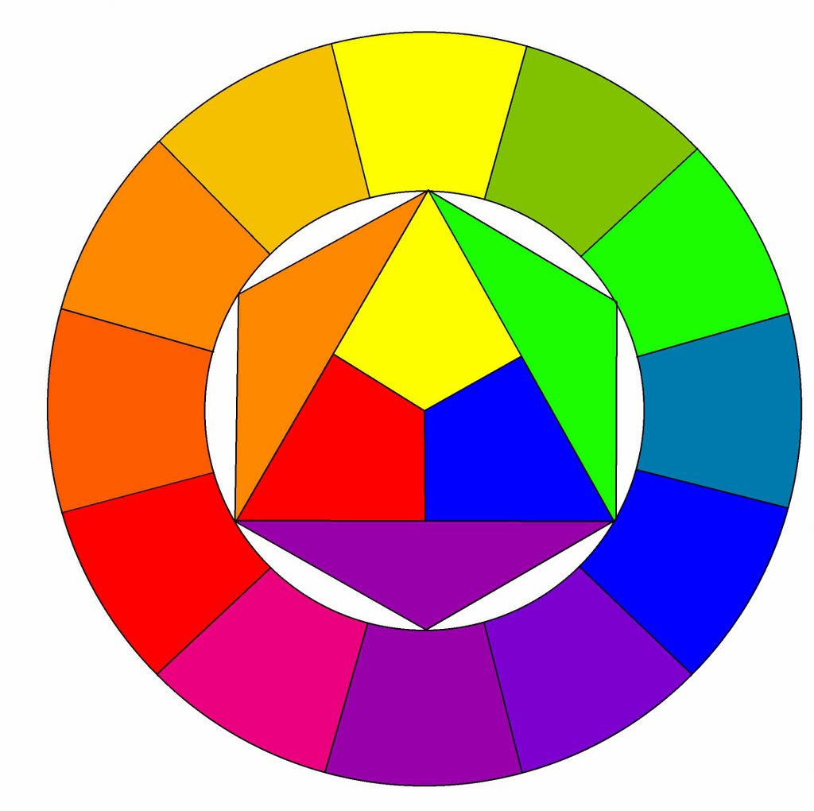

# NOTAS DISEÑO

# Composition

### Focal element
The element that the viewer is drawn to immediately 
- **Contrast:** from other elements
- **Saturation:** more saturated than other elements
- **Camera focus:** on a particular item
- **Motion:** focal element remains still while the others are motion blurred
- **Faces or human figures**: naturally catch our attention
- **Guiding lines:** made by the scene itself, like **roads** or the borders of an object, pointing to the focal element. Blocking lines can also appear
- **Geometry**: Geometrical shapes catch our attention, objects with squared, triangular, spherical, pyramidal shapes, etc
- **Framing:** Physical objects in the scene surround the edges of the image itself, making the 'main' scene appear like in a frame

### Structure
Organization of the elements in the scene, based on a rule. Take with a grain of salt. Some of the most balanced, like symmetry, can be intentionally broken by a focal element, to add intentional tension.
- Rule of thirds
- Golden ratio
- Pyramid
- Symmetry
- Balancing elements
- Leading lines (roads)

### Balance
Mantain a visual weight hierarchy, to avoid too much uniformity, but still mantain harmony. This Main-Secondary-Detail hierarchy can be applied with:
- Size
- High contrast
- Saturation of color
- Faces / figures

# Color
[Adobe Color](https://color.adobe.com/)

### Luminosidad y saturación
1. No sobrecargarlos ni sobreusarlos
2. Usarlos para guiar la vista del espectador
3. Storytelling
4. Emoción de la escena (saturación y vibrancia: felicidad, imagen apagada: tristeza)
5. LLamar la atención hacia un punto concreto

### Harmonías cromáticas

Se refieren al tono, no a la luminancia/saturación

- **Monocromática**: Un solo color. 
  - Funciona bien en composicionesde un solo elemento. 
  - Atmosférico.
- **Análogo**: Colores adyacentes en la rueda. 
  - Calmado, relaja la vista, aparece en la naturaleza (verde-azul-amarillo)
  - Como están muy juntos, asegurarse suficente contraste entre ellos.
  - Un color podría dominar, el otro estar de apoyo, y usar el tercero como detalle.
  - Se puede elegir priorizar análogos fríos o análogos cálidos
- **Triádico**: Tres colores equidistantes en la rueda. 
  - Funciona mejor en escenas de dibujos, no realistas. 
  - Muy vibrante, incluso si son poco saturados. 
  - Difícil de conseguir.
  - Deberían estar balanceados, uno dominaría y los otros dos como detalle.
- **Complementario**: Colores opuestos. 
  - Muy popular. 
  - Naturalmente agradable a la vista. 
  - Debería usarse uno de los dos colores de forma predominante al otro. 
  - Fuerza el mezclar colores cálidos y fríos. Funciona bien el anaranjado-azul, y el rojo-verde.
  - Al ser los opuestos, causan tensión, así que no deberían saturarse mucho, o podría dejarse que uno domine sobre el otro.
- **Complementario partido**: 
  - Triángulo equilátero (Se escogen los dos colores adyacentes al complementario, y no se usa el complementario). 
  - Muy vivo y feliz. 
  - Alto contraste pero con menos tensión que el complementario
- **Mediador**: Similar al complementario y el partido. 
  - El tónico es el opuesto al dominante (el complementario).
  - Se elije un color dominante y su color complementario.
  - Tras ello, se toma uno de los colores adyacentes al tónico, que será el que mediará entre tónico y dominante
- **Rectángulo o tetrádico**: Dos pares de complementarios, dispuestos en forma cuadrada o rectangular en la rueda. 
  - Prestar atención al reparto correcto de cálidos y fríos.
  - Nunca repartir cada uno al 25%, uno o dos colores como mucho deberían ser más predominantes e intensos, y los otros dos/tres más secundarios, ya que es facil que se pisen entre sí
  - Dificil de consetguir, pero muy agradable a la vista.

**Notas:** 
- Prestar atención al balance de cálidos y fríos, en funcion a la harmonía elegida
- Segun lo mencionado en saturación: No saturar los colores en exceso, tomar tonalidades harmónicas, pero elegir a la vez variantes neutrales o poco saturadas, y equilibrar de forma jerárquica las zonas de mayor/menor saturación; saber cuando equilibrar los colores y cuando dejar que unos dominen sobre otros en saturación.

# Iluminación
### Dirección

- **Frontal:** Aplana la imagen
- **Frontal-arriba:** Neutral
- **Frontal-lateral:** Netural
- **Superior:** siniestra
- **Trasera (rim-only):** misteriosa
- **Lateral (split):** misteriosa
- **Inferior:** misteriosa

### Tamaño
- **Reducido:** Sombras duras, ideal para **resaltar detalles superficiales**.  
    Misterioso, siniestro.  
    Día soleado.  
- **Amplio:** Sombras suaves, **oculta imperfecciones y resalte la forma**  
    Más natural y agradable
    Día nublado.  
    Demasiado amplio borra demasiado el detalle  

Utilizar una mezcla, con texturas de degradados e IES

**Golden Hour**: Atardecer, amanecer. Angulo suficente (y por scattering, tamaño) para la generación de sombras, que añaden dimensión a la imagen, y realzan la forma y los detalles.

### Color
#### Natural
El color natural de luz es rojo/azul.
**Gama de Kelvin:** (1000K) Rojo | Anaranjado | Amarillo | (6500K) Blanco neturo | Azul celeste | (10000k) Cyan

"Truco": Entorno en azul para dar sensación de frialdad, y poner detalles lumínicos amarillos/anaranjados para sensación de calidez

**Blue Hour**: Durante los mismos períodos del golden hour (anochecer?). La luz del exterior es suficientemente alta como para ser el exterior visible, pero lo suficientemente apagada como para poder concidir en exposición con la luz del interior.

#### Artificial
Luces neon, de colores... Aquí se incluiría la iluminación verdosa, morada... Pueden ser muy saturadas e intensas.

Se pueden usar para fines de storytelling

### Resumen
Mantenerlas neutrales (blanco-ish), cálidas-frías (más natural), o emplear artificialidad (luces saturadas, de colores, etc.)

### Readability
#### Cantidad
Mantenerla en el punto medio, lo justo; sobretodo teniendo en cuenta que muchos usuarios tienen monitores no calibrados que pueden dificultar la visualización de la imagen.

#### Separación
Tanto del fondo como entre objetos

Rim-lights: Permiten diferenciar mejor los objetos y da mayor diversidad de sombreados. No hay que usarlas siempre, en entornos naturales, no abusar de estas rim-lights ya que pueden verse demasiado obvias.

#### Otras notas
En blender, se puede poner 'false color' en el espacio de color, lo ideal es que el debug previewer aparezca en gris/grisaceo.

3-Point lighting: Luz principal, de relleno, rim-light

### Énfasis
Ley del cuadrado inverso de la distancia:
- Luz cercana (compensando, poco intensa): detalla mucho un único punto del objeto
- Luz lejana (compensando, muy intensa): reparte la iluminación por todo el objeto

Esto puede usarse para realzar la totalidad de un objeto, o llamar la atención hacia un punto concreto.

Evitar excesivo contraste para evitar distracciones, evitar ausencia de contraste para no perder el foco del espectador.

### Implied lighting
Usar sombras y luces para dar a entender la existencia de elementos que estén fuera del campo de visión de la cámara (la sombra de un monstruo tras la esquina, sombras de árboles entrando por la ventana...)

# Sobre SCI-FI
[Paul pepera es un excelente ejemplo](https://www.artstation.com/paulpepera)

- **Romper el molde:** A la hora de añadir detalles, añadirlos de forma artística, donde nosotros queramos realmente, sin dejarnos llevar por lo "fácil" ni por la topología de la malla. 
- **Remaches, tornillos y tuercas**: No colocarlos siempre en las esquinas, ni colocarlos constantemente en todos los bordes; ponerlos donde tengan sentido, coherencia, sean más o menos realistas, y sin abusar.
- **Evitar el efecto Sandwich y Sierra**: Evitar formas lineales espaciadas uniformemente, puesto que dan muchisima repetitividad. Así mismo, evitar formas eque entran y salen repetida y uniformemente, porque, sobre todo al tilearlo; darán una fea forma de siera. Evitar exceso ángulos de 45º y diagonales innecesarias
- **No abusar de rejillas de ventilación**: Deberían tener un propósito realista; no simplemente estar por estar, ni llenar espacio porque sí.
- **Tuberías**: Intentar integrarlas en el modelo lo máximo posible; no ponerlas en exceso (que sean funcionales), jerarquía de tamaños (gruesas, finas, medianas...), jugar con la forma pero sin caotizarla demasiado. Se puede jugar también con el propio perfil de la tubería/cable.
- **Formas**: jugar con la forma, hacerla lo suficientemente interesante con biseles, redondeos... Los diseños excesivamente precisos y cuadrados son poco interesantes.
- **Greebles**: No utilizar demasiados greebles que no tengan propósito ni funcion 'práctica/real', no simplemente añadir detalle por añadirlo. Respetar también un correcto balance jerárquico, con áreas más detalladas (donde tenga sentido) y áreas de descanso.
- **Juntas/panelling**: Evitar vertices de 4 lados en el diseño, ya que da sensación de panelamiento; reducir en general la cantidad de 'cortes' y no dejarnos llevar por la geometría de la malla (no colocarlos justo donde ya tengamos un edge colocado, por ejemplo).
- **Luces**: Posición y color realista, no poner luces alocadamente.
- **Ángulos y diagonales**: No abusar de ellos constantemente, ponerlos donde tengan sentido. Deberían estar 'organizados' y ser todos de más o menos el mísmo ángulo (menor de 45, entre 30-20 queda bonito) y en la misma dirección
- **Respetar áreas de descanso**: y no colocar demasiados detalles amontonados; respetar una buena jerarquía de detalle. 70-20-10 / 80-20

# NOTAS ALEX SENECHAL (ORGANIZAR)
### Vocabulary
- **Transitional element:** An element that connects or explains the separation between two elements.
- **Form transition:** How one form transforms into another: a sharp edge, smoothing...
- **Form:** The basic idea of volume
- **Plane changes:** An edge, wheter it is soft or hard, a way of describing a change in form/shading
- **Silhouete:** the outline of a subject
- **Negative space:** the space opposite the subject, that breaks into the silhouette.
- **Sandwiching:** When a bunch of lines or very similar elements get grouped and create an indiscernible mess
- **Non descriptive line:** A line that is created by visual elements, such as trees next to a road
- **Visual intensity:** how strong a particular element is, wheter it is by color contrast, size importance...
- **Value:** how light or dark a point in the image is. Form and value are inseparable

### How to learn
- Form vs function
- Look for other people's artwork in artstation
- Criticize your own artwork
- Introduction/Rough understanding/Repetition and solidification of understanding/Automatic execution
- Take feedback

### Design tips
- **Avoid evenness.** No matter how hard you try, you'll always end up making even things. Make a paint/line-over.
- For paintovers, up the blacks in the image curves; that will make the image easier to paint on top.
- Mindmap: the 6 W's ( who, when, how... ), of a particular item (how did people used this?, how did it age?)

### Evenness
- Hierarchy of proportions: Large is primary, medium is secondary, small is tertiary
- If everyone is special, no one is special
- **70/30 rule**
- "More this than that": Something is larger, something is smaller, something is duller, something is more saturate...
- Avoid 'pannelling', and repetition as much as possible
- Avoid having 50/50 items, specially in shape and size, but also in arrangement and color
- **The modular corridor example: 2-1-8-2 rather than 2-2-2-2-2**
- This also applies to negative space
- Evenness is not repetition. Unintentional evenness is bad and to be avoided; repetition is a perfectly usable tool when used corrently and intentionally
- In certain cases, specially for man-made, industrial design, evenness is acceptable and used.
- Look for evenness not only in terms of items themselves, but in terms of spatial division
- **Thinking about 'how to divide the white canvas', not about 'what I want to paint'**
- The positioning of an element compared to its 'sibling' or 'parent' elements is also important

### Eco & Framing
- Reutilización de elementos, simplifica el número de 'cosas distintas' para que el ojo tenga más facil interpretar la imagen
- **Regla de 3:** El mínimo para obtener un patrón, pero no demasiadas como para volverse demasiado caótico. Intentar aplicar el eco en grupos de tres
- **Framing**: Reforzar lo que ya existe, generalmente mediante 'linework', es una forma de hacer eco y reforzar una línea ya existente.
- Reutilizar partes una y otra vez sobre el diseño, generalmente detalles terciarios o secundarios.
- Pensar en la separación y la posición entre ellos, y hacia a donde apuntan en su conjunto, para guiar el ojo.
- No solo formas como tornillos o decals, si no también en cuanto a materiales colores o incluso elementos enteros
- Los circulos generalmente necesitan ser reforzados

### Ritmo y repetición
- La repetición es una herramienta, y debe ser usada, aunque con cautela.
- **Líneas no descritas:** Las líneas descritas son aquellas rectas y continuas dibujadas expresamente. Las líneas NO descritas son aquellas que se forman en base a la repetición de elementos, como una serie de árboles en los bordes de un camino.
- El ritmo es crear patrones dinámicos rompiendo uniformidad en base a su posición y su espaciado, jerarquía...
- Esto se entrelaza con la regla del 70/30, deberíamos tener patrones grandes, medianos y pequeños detalles.
- La repetición pueden ser útiles en los espacios vacíos, siempre y cuando sean discretos
- Una forma sencilla, siempre que sea discreta, de añadir detalle fácil sin sobrecargar el elemento.
- 